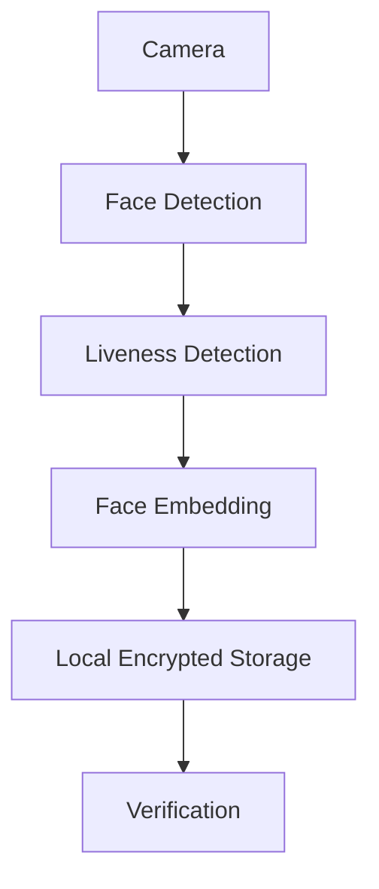
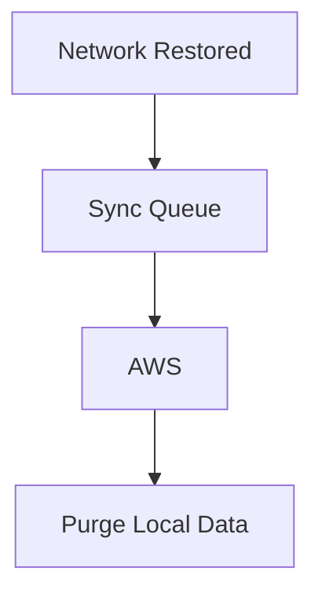
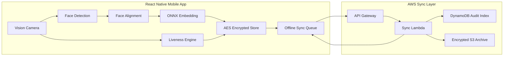
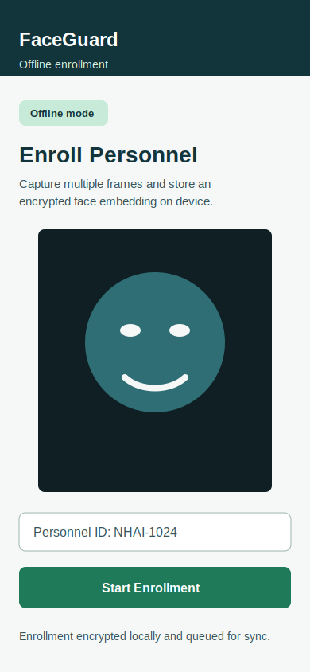
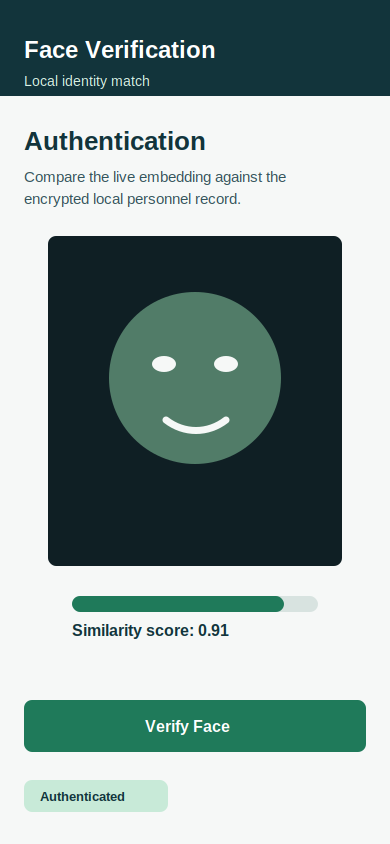
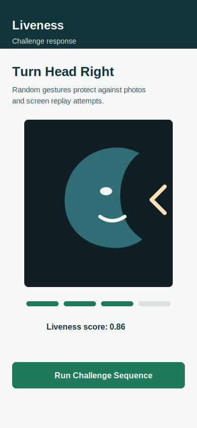
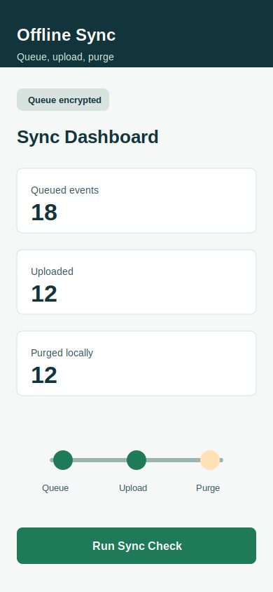

# FaceGuard

Secure, lightweight, fully offline facial recognition and liveness detection for NHAI field personnel authentication in remote and zero-network environments.

FaceGuard is built for NHAI Hackathon 7.0 as a practical field authentication system: personnel can enroll, prove liveness, verify identity, and queue audit events without network access. When connectivity returns, encrypted sync events are uploaded to AWS and acknowledged records are purged locally.

## Problem Statement

Develop a secure, lightweight, fully offline facial recognition and liveness detection system for field personnel authentication in remote and zero-network environments.

The solution must support React Native, Android, iOS, low-RAM devices, offline liveness detection, local encrypted storage, and AWS sync-and-purge when connectivity returns.

## Solution Overview

FaceGuard runs the authentication decision on the device:

1. Capture a live face frame burst.
2. Detect and align the primary face.
3. Run challenge-response liveness checks.
4. Generate a lightweight face embedding.
5. Compare against encrypted local identity records.
6. Queue only audit events for later cloud sync.
7. Purge local queue records only after backend acknowledgement.

No benchmark results are claimed in this repository. Accuracy, latency, and model-size values are listed only as target metrics until measured on representative devices.

## Architecture Diagram

### Offline Authentication



### Network Restored



### System Architecture



## Features

- Fully offline enrollment and authentication.
- React Native TypeScript app for Android and iOS.
- Camera integration through `react-native-vision-camera`.
- Face detection, alignment, embedding, and similarity service architecture.
- ONNX Runtime Mobile integration path through `onnxruntime-react-native`.
- Challenge-response liveness: blink, smile, turn left, turn right.
- Anti-photo and anti-screen replay scoring hooks.
- AES-256-GCM encrypted local storage.
- Local identity records, authentication logs, and sync queue.
- AWS sync-and-purge backend using API Gateway, Lambda, DynamoDB, and S3.
- Professional documentation, diagrams, UI mockups, and testing plan.

## Tech Stack

| Layer | Technology |
|---|---|
| Mobile | React Native `0.85.3`, TypeScript |
| Camera | `react-native-vision-camera` |
| ML Runtime | `onnxruntime-react-native` |
| Face Model Strategy | MobileFaceNet or lightweight InsightFace ONNX |
| Secure Storage | AsyncStorage encrypted with AES-256-GCM, keys in Keychain/Keystore |
| Connectivity | `@react-native-community/netinfo` |
| Backend | AWS SAM, API Gateway, Lambda, DynamoDB, S3 |
| Tests | Vitest for core offline services |

## Repository Structure

```text
FaceGuard/
├── README.md
├── LICENSE
├── docs/
│   ├── ARCHITECTURE.md
│   ├── INTEGRATION_GUIDE.md
│   ├── SECURITY.md
│   ├── SYNC_PURGE.md
│   ├── TESTING_PLAN.md
│   ├── EVALUATION_MAPPING.md
│   └── screenshots/
├── mobile/
├── models/
├── backend/
├── prototype/
├── scripts/
├── tests/
└── assets/
```

## UI Mockups

| Enrollment | Authentication |
|---|---|
|  |  |

| Liveness Challenge | Sync Dashboard |
|---|---|
|  |  |

## Installation

Prerequisites:

- Node.js 22 or newer.
- Android Studio and JDK for Android builds.
- Xcode and CocoaPods for iOS builds on macOS.
- AWS SAM CLI for backend deployment.

Root validation and tests:

```bash
cd FaceGuard
npm install
npm run validate
npm test
```

Mobile app:

```bash
cd FaceGuard/mobile
npm install
npm run android
```

iOS:

```bash
cd FaceGuard/mobile
npm install
cd ios && pod install && cd ..
npm run ios
```

Backend:

```bash
cd FaceGuard/backend/infra
sam build
sam deploy --guided
```

## Target Metrics

These are project targets, not measured benchmark claims:

| Metric | Target |
|---|---|
| Recognition accuracy | Above 95 percent after dataset validation |
| Recognition plus liveness latency | Under 1 second after hardware validation |
| Model size | Around 20 MB after quantization |
| Network dependency | None for authentication |
| Device class | Android and iOS devices with 3 GB RAM |

## Documentation

- [Architecture](docs/ARCHITECTURE.md)
- [Model Pipeline](docs/MODEL_PIPELINE.md)
- [Setup And Usage](docs/SETUP_AND_USAGE.md)
- [Demo Flow](docs/DEMO_FLOW.md)
- [Brief Compliance](docs/BRIEF_COMPLIANCE.md)
- [Integration Guide](docs/INTEGRATION_GUIDE.md)
- [Security And Threat Model](docs/SECURITY.md)
- [Sync And Purge Design](docs/SYNC_PURGE.md)
- [Testing Plan](docs/TESTING_PLAN.md)
- [Evaluation Mapping](docs/EVALUATION_MAPPING.md)
- [Presentation Outline](docs/PRESENTATION.md)
- [Screenshots And Mockups](docs/screenshots/README.md)

## Future Scope

- Add verified quantized ONNX models with model cards and reproducible conversion scripts.
- Wire native frame processors for production face detection and landmark extraction.
- Validate thresholds on consented field datasets across lighting, age groups, skin tones, glasses, and outdoor conditions.
- Add signed sync payloads, certificate pinning, and device attestation.
- Add Datalake 3.0 ingestion automation and admin audit dashboard.
