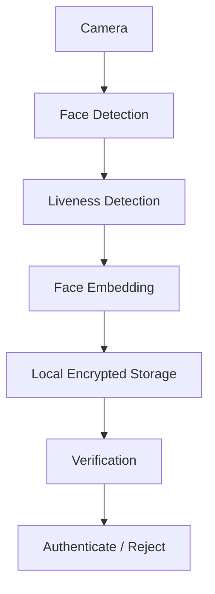
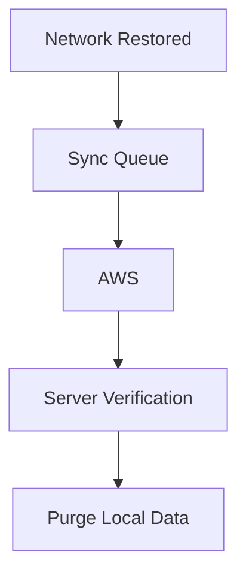
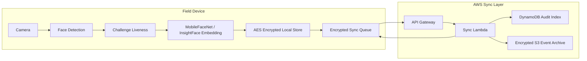

# FaceGuard Architecture

FaceGuard is built around a strict offline-first authentication boundary. The mobile app performs face capture, liveness verification, embedding generation, encrypted storage, and identity matching locally. Cloud services are used only after connectivity returns for audit sync and purge acknowledgement.

## Offline Authentication Flow

## Sync And Purge Flow

## Complete System View

## Module Responsibilities

| Module | Responsibility |
|---|---|
| Camera | Captures live frames through React Native Vision Camera |
| Face Detection | Finds the primary face and landmark points |
| Face Alignment | Produces a normalized 112 x 112 face crop |
| Liveness | Scores blink, smile, head turns, texture, and replay risk |
| Embedding | Runs lightweight ONNX model inference |
| Storage | Encrypts embeddings, logs, and sync queue records |
| Sync | Uploads queued events after connectivity returns |
| Purge | Deletes only records acknowledged by the backend |

## Target Constraints

These are engineering targets, not claimed benchmark results:

- Fully offline authentication.
- Android and iOS support through React Native.
- 3 GB RAM device compatibility.
- Model footprint around 20 MB after quantization.
- Recognition and liveness under 1 second after hardware validation.
