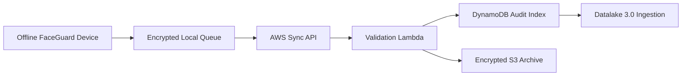

# Datalake 3.0 Mapping

FaceGuard should integrate with Datalake 3.0 as a privacy-preserving event source, not as a raw biometric image feed.

## Event Ingestion Path

## Recommended Event Schema

| Field | Type | Notes |
|---|---|---|
| `eventId` | string | Generated offline |
| `personnelId` | string | NHAI ID or pseudonymous key |
| `deviceId` | string | Registered field device |
| `eventType` | string | Enrollment, auth success, auth failure, purge confirmation |
| `occurredAt` | string | ISO timestamp from device |
| `syncedAt` | string | Server timestamp |
| `modelId` | string | Model/runtime version |
| `similarityBucket` | string | Rounded score bucket |
| `livenessBucket` | string | Rounded liveness score bucket |
| `payloadHash` | string | SHA-256 hash for tamper checking |

## Data Minimization

Do not sync:

- Raw face frames.
- Face crop images.
- Full-resolution biometric vectors unless explicitly approved by policy.
- Debug overlays containing identifiable images.

## Purge Confirmation

After Datalake 3.0 ingestion accepts an event, the backend returns the event ID to the device. The device deletes only that local queue record and can enqueue a compact `PURGE_CONFIRMATION` event if policy requires auditability.
