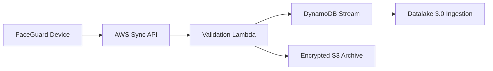

# NHAI Integration Guide

This guide explains how FaceGuard can be integrated into an NHAI field application and connected to Datalake 3.0 through an offline sync pipeline.

## Dependencies

Mobile:

- React Native `0.85.3`
- TypeScript
- `react-native-vision-camera`
- `onnxruntime-react-native`
- `react-native-keychain`
- `react-native-quick-crypto`
- `@react-native-community/netinfo`
- `@react-native-async-storage/async-storage`

Backend:

- AWS SAM
- API Gateway HTTP API
- AWS Lambda
- DynamoDB
- S3 with KMS encryption

## Native Modules

FaceGuard requires native module installation for camera, secure key storage, crypto, and ONNX inference.

Android:

1. Add camera permission in `AndroidManifest.xml`.
2. Enable Vision Camera native dependencies.
3. Bundle ONNX models in Android assets or download them through a signed provisioning flow.
4. Use Android Keystore through `react-native-keychain`.

iOS:

1. Add `NSCameraUsageDescription` to `Info.plist`.
2. Run CocoaPods installation.
3. Bundle ONNX models in the app target.
4. Use iOS Keychain through `react-native-keychain`.

## React Native Bridge

The project keeps native concerns behind service interfaces:

| Bridge Area | FaceGuard Service |
|---|---|
| Camera frames | `CameraFrameService` |
| ONNX inference | `OnnxFaceEmbeddingSession` |
| Secure storage | `ReactNativeEncryptedStore` |
| Connectivity | `NetInfoConnectivityAdapter` |
| Cloud upload | `AwsUploadAdapter` |

This allows NHAI teams to replace a native implementation without changing the screen flow or business logic.

## Datalake 3.0 Integration

FaceGuard should not push raw face images to a central system. Recommended Datalake 3.0 event payload:

| Field | Description |
|---|---|
| `eventId` | Unique offline event ID |
| `personnelId` | NHAI personnel ID or pseudonymous key |
| `deviceId` | Registered device identifier |
| `eventType` | Enrollment, success, failure, or purge confirmation |
| `occurredAt` | Device timestamp |
| `modelId` | Embedding model version |
| `similarityBucket` | Rounded score bucket, not raw biometric vector |
| `livenessBucket` | Rounded liveness score bucket |
| `payloadHash` | Hash for tamper checking |

Recommended integration path:



## Build Instructions

Root validation:

```bash
cd FaceGuard
npm install
npm run validate
npm test
```

Android:

```bash
cd FaceGuard/mobile
npm install
npm run android
```

iOS:

```bash
cd FaceGuard/mobile
npm install
cd ios && pod install && cd ..
npm run ios
```

AWS backend:

```bash
cd FaceGuard/backend/infra
sam build
sam deploy --guided
```

## Production Integration Checklist

- Register devices before field deployment.
- Pin backend certificates for the sync API.
- Sign sync events with device-held keys.
- Validate model licenses and conversion steps.
- Run field validation before selecting final thresholds.
