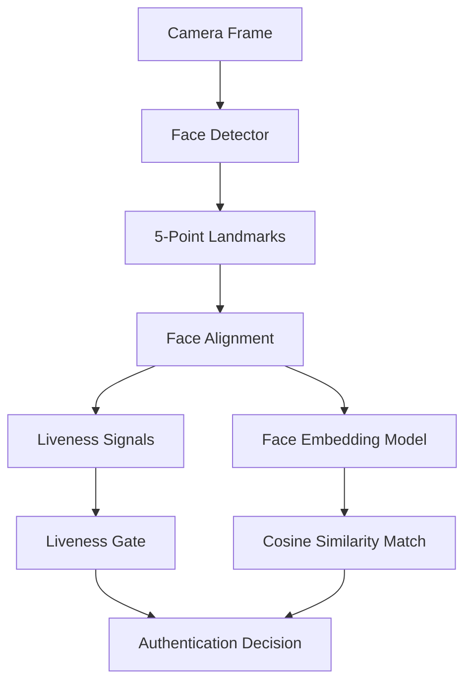

# Model Pipeline

FaceGuard uses a modular pipeline so each model can be replaced as validation improves. The current repository includes production-oriented service architecture and deterministic demo inference for tests; final model binaries must be added after license and device validation.

## Pipeline

## Recommended Models

| Task | Candidate | Notes |
|---|---|---|
| Face detection | SCRFD lightweight variant | Use ONNX export with landmarks |
| Face embedding | MobileFaceNet or compact InsightFace | Quantize after validation |
| Passive liveness | MiniFASNet-style model | Validate license and domain fit |
| Active liveness | Landmark-based gestures | Blink, smile, left turn, right turn |

## Preprocessing

1. Select the largest detected face.
2. Use eye, nose, and mouth landmarks for alignment.
3. Crop face with padding.
4. Resize to `112 x 112`.
5. Normalize pixels to the embedding model input range.
6. Normalize output embedding before comparison.

## Validation Required

Do not claim production accuracy until:

- Model source and license are documented.
- Conversion scripts are reproducible.
- Quantized model size is measured.
- Latency is measured on target Android and iOS devices.
- Thresholds are selected using consented validation data.
