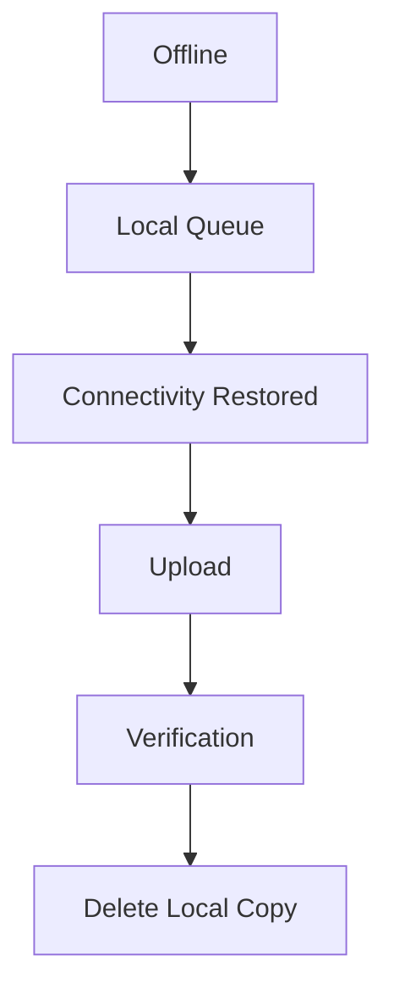
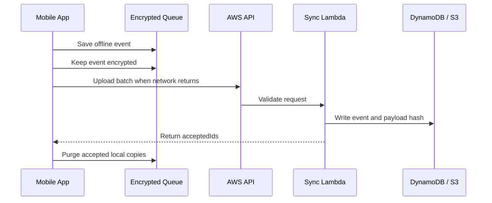

# Sync And Purge Design

The FaceGuard mobile app authenticates personnel offline. Sync is a delayed audit workflow that runs only when connectivity returns.

## Flow

## Detailed Sequence

## Purge Rules

| Condition | Device Action |
|---|---|
| Backend returns accepted ID | Delete matching local queue record |
| Backend rejects event | Keep record and surface failure |
| Upload fails | Keep record and increment attempts |
| No connectivity | Do nothing |
| Partial success | Purge accepted records only |

## Why This Matters

This prevents data loss during poor connectivity and avoids storing unnecessary audit records after the central system has accepted them.

## AWS Components

- API Gateway receives `/sync/events`.
- Lambda validates events and writes accepted records.
- DynamoDB stores audit index and payload hash.
- S3 stores encrypted event payload archive.
- Mobile app purges only acknowledged event IDs.
