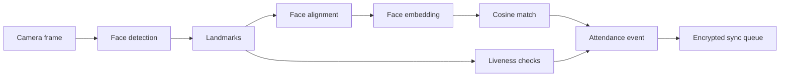

# Technical Documentation

FaceGuard is an offline-first facial authentication system for NHAI field personnel. The project is designed so enrollment, liveness verification, face matching, and attendance event creation can happen without internet access.

This document describes the production architecture target. The repository includes working TypeScript service code and deterministic demo inference for local tests. Final benchmark claims must be added only after verified model binaries and physical-device measurements are available.

## End-To-End Pipeline



## Runtime Design

The mobile code is split into small services:

| Area | Implementation |
|---|---|
| Camera capture | `mobile/src/services/camera/CameraFrameService.ts` |
| Face detection | `mobile/src/services/face/FaceDetectionService.ts` |
| Face alignment | `mobile/src/services/face/FaceAlignmentService.ts` |
| Embedding inference | `mobile/src/services/face/FaceEmbeddingService.ts` |
| ONNX runtime adapter | `mobile/src/services/face/OnnxFaceEmbeddingSession.ts` |
| Similarity scoring | `mobile/src/services/face/SimilarityService.ts` |
| Liveness scoring | `mobile/src/services/liveness/LivenessEngine.ts` |
| Encrypted storage | `mobile/src/services/storage/ReactNativeEncryptedStore.ts` |
| Sync and purge | `mobile/src/services/sync/SyncManager.ts` |

## Model Strategy

The current implementation is model-runtime agnostic at the service boundary. Two production paths are realistic:

| Path | Runtime | Notes |
|---|---|---|
| ONNX path | `onnxruntime-react-native` | Already represented in code through `OnnxFaceEmbeddingSession` |
| TFLite path | `react-native-fast-tflite` | Strong option for Vision Camera frame processors and mobile acceleration |

Recommended open-source model families:

- Detection: BlazeFace, SCRFD lightweight variant, or equivalent.
- Landmarks: MediaPipe Face Mesh style landmarks or compact landmark model.
- Embedding: MobileFaceNet or compact InsightFace variant.
- Liveness: active landmark challenges plus optional passive anti-spoof model.

Do not commit model binaries until licenses, conversion steps, and measured sizes are documented.

## Liveness Design

FaceGuard uses challenge-response liveness so a static photo is not enough:

| Challenge | Signal |
|---|---|
| Blink | Eye-open probability drops |
| Smile | Smile probability rises |
| Turn left | Yaw angle moves negative |
| Turn right | Yaw angle moves positive |
| Anti-photo | Texture score remains strong |
| Anti-replay | Replay-risk score remains low |

Challenge order should be randomized in production.

## Offline Attendance Event

Recommended attendance event shape:

```json
{
  "eventId": "offline-generated-id",
  "personnelId": "NHAI-1024",
  "deviceId": "registered-device-id",
  "eventType": "AUTH_SUCCESS",
  "occurredAt": "2026-06-05T07:00:00.000Z",
  "modelId": "mobilefacenet-quantized-v1",
  "similarityBucket": "0.90-0.95",
  "livenessBucket": "0.80-0.90",
  "payloadHash": "sha256"
}
```

Raw camera frames should not be stored or synced.

## Benchmark Protocol

FaceGuard currently lists target metrics only. To publish measured metrics, record:

- Device model and chipset.
- Android or iOS version.
- App build mode.
- Model names and exact file sizes.
- Acceleration mode, such as CPU, NNAPI, GPU, or Core ML.
- Number of test runs.
- Median and p95 latency.
- Memory use during camera and inference.
- Dataset composition and consent protocol.

Unsupported benchmark claims should not be added to the README.
