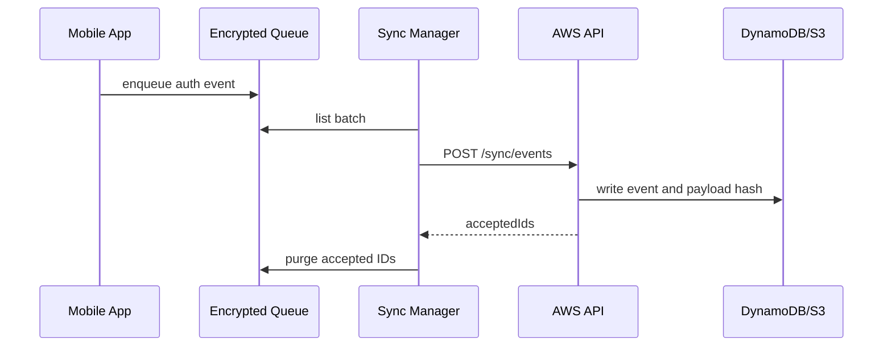

# Sync And Purge Workflow

FaceGuard authentication does not depend on connectivity. Network sync is delayed audit transport.

## Mobile Flow

1. Authentication completes locally.
2. A compact event is written to the encrypted queue.
3. `NetInfoConnectivityAdapter` checks connectivity.
4. `SyncManager` uploads a bounded batch.
5. Backend returns `acceptedIds`.
6. `PurgeManager` deletes only accepted local queue records.
7. Failed records remain queued and attempt counts increase.

## Backend Flow

The Lambda validates event shape, writes the payload to encrypted S3, writes an audit index to DynamoDB, and returns accepted event IDs. Duplicate writes are handled idempotently with conditional DynamoDB writes.

## Data Sent To Cloud

Recommended event payloads:

- Personnel ID or pseudonymous personnel key.
- Event type.
- Device ID.
- Timestamp.
- Liveness score bucket.
- Similarity score bucket.
- Model ID and app version.

Do not upload raw face frames from field devices.
